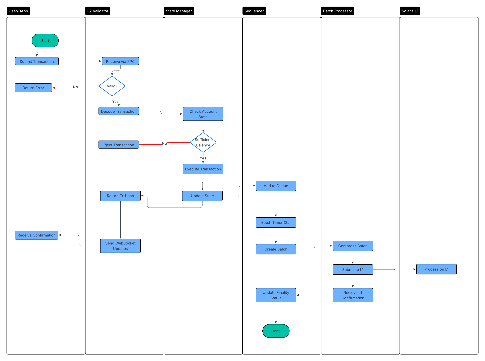

# Tiny Rollup - A Minimal Solana L2 Rollup


A minimal implementation of a Solana L2 rollup that batches transactions and submits them to the Solana L1 for settlement.

## Overview
Tiny Rollup is an educational implementation of a Layer 2 rollup on Solana that demonstrates:

- Transaction batching and sequencing
- State management with Merkle roots
- JSON-RPC interface compatibility
- L1 settlement via Solana transactions

## 🚀 Getting Started
### Prerequisites
- Rust 1.70+
- Solana CLI (for local testing)

Installation
### 1. Clone and build:

```bash
git clone git@github.com:collin5/tiny-rollup.git
cd tiny-rollup
cargo build
```

### 2. Run with local Solana validator:
```bash
# Start local Solana validator
solana-test-validator

# Start the rollup
cargo run -- --solana-rpc http://localhost:8899 --port 8890 --db-path ./rollup_db
```

### 3. Run with Solana devnet:
```bash
cargo run -- --solana-rpc https://api.devnet.solana.com --port 8899 --db-path ./rollup_db
```

## Testing with Curl
```bash
# Get latest blockhash
curl -X POST http://localhost:8899 \
  -H "Content-Type: application/json" \
  -d '{
    "jsonrpc": "2.0",
    "id": 1,
    "method": "getLatestBlockhash",
    "params": []
  }'

# Get account balance
curl -X POST http://localhost:8899 \
  -H "Content-Type: application/json" \
  -d '{
    "jsonrpc": "2.0",
    "id": 1,
    "method": "getBalance",
    "params": ["11111111111111111111111111111111"]
  }'
```

## RPC Methods
- `getAccountInfo` - Get L2 account information
- `getBalance` - Get account balance in lamports
- `sendTransaction` - Submit transaction to L2
- `getLatestBlockhas`h - Get current L2 blockhash
- `simulateTransaction` - Simulate transaction execution
- `getTransaction` - Get transaction details (TODO)

## Current Features
 
- [x] Transaction Processing: Validate and execute Solana transactions in L2
- [x] State Management: In-memory + persistent storage with RocksDB
- [x] Sequencer: Batch transactions every 2 seconds (up to 100 tx/batch)
- [x] JSON-RPC Server: Compatible with Solana RPC methods
- [x] L1 Submission: Submit batches to Solana mainnet/devnet
- [x] Account Management: Basic lamports transfer between accounts


## TODOS
### Proper Merkle Tree State Roots

- [ ] Implement sparse Merkle tree for state commitments
- [ ] Generate proper state roots for L1 verification
- [ ] Add state root to batch submissions

### Transaction Finality & Fraud Proofs

- [ ] Implement challenge period for fraud proofs
- [ ] Add state transition verification
- [ ] Create fraud proof generation

### EVM/SVM Compatibility

- [ ] Add support for EVM bytecode execution
- [ ] Add cross-chain message passing


